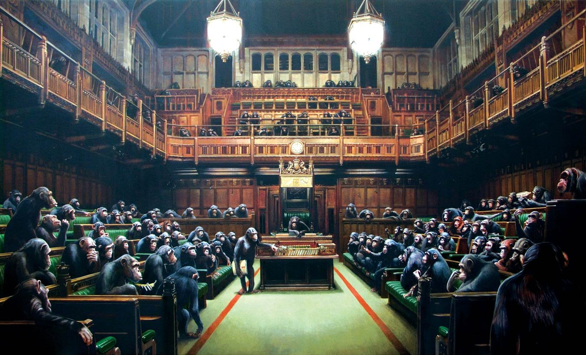

> “We are just an advanced breed of monkeys on a minor planet of a very average star. But we can understand the Universe. That makes us something very special.”

― Stephen Hawking

## My Background
My name is Cole Striler. I graduated from UC Berkeley in May 
2020 and I'm currently a software engineer at Apple. 

I am also
the host of the [Mind Over Monkey podcast](https://podcasts.apple.com/us/podcast/mind-over-monkey/id1516382185),
the co-founder of [DatafiedWorld.com](http://datafiedworld.com/), and the co-founder of [Xuxa Socks](https://www.instagram.com/xuxasocks/?hl=en).

Here are my social profiles:
- [Twitter](https://twitter.com/ColeStriler)
- [LinkedIn](https://www.linkedin.com/in/cole-striler-b15970100/)
- [GitHub](https://github.com/colestriler)
- [YouTube](https://www.youtube.com/channel/UCD8kYSV6pM7lqtg1BnzSYZA?view_as=subscriber)

## Why Blog?
1. I have lots of ideas in my head, and often times when I explain them to others, I expose gaps
in my own thinking. I believe blogging will help me think through a lot of these concepts in more
detail to fill in some of these gaps.

2. Sometimes I have an interesting thought that is too long to be a Tweet but too short to be a book.
I don't currently have a platform to release these ideas into the world -- until now!

3. To teach and to learn.

## What to expect from me
Lot's of random ideas, thoughts, or discussions about various topics. One thing I want to emphasize is
that I will do not stand by what I say in my blog posts for the entirety of my life. What I write is 
merely a reflection of a feeling or a thought in my mind at that given moment in time. 

As time goes on, however, I am highly likely to change my mind on particular topics as I am exposed to 
new information. I believe changing your mind is an essential part of learning, which I don't think is 
encouraged enough in today's public eye.
